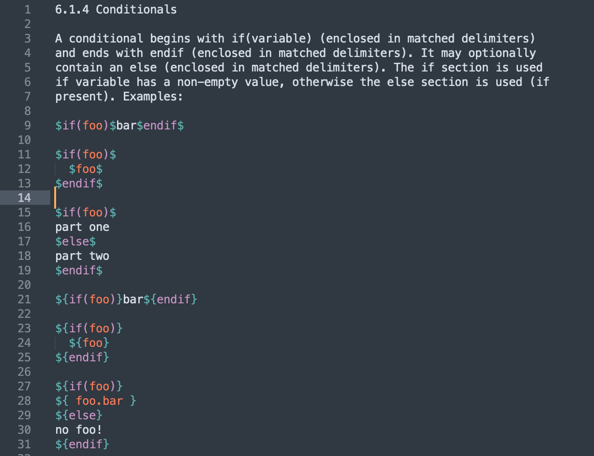

# sublime-syntax-pandoc-doctemplates

Sublime Text syntax file for the `doctemplates` language that is used by pandoc as a general templating language.

The `doctemplates` language is described here:

* https://github.com/jgm/doctemplates
* https://pandoc.org/chunkedhtml-demo/6.1-template-syntax.html

## Preview

## Bugs

This project was a quick experiment to help me understand the pandoc template syntax. The language definition probably contains many bugs.

## Installation

1. Download this repository as a ZIP file.
2. Extract the ZIP file.
3. Move the resulting folder to the *user package folder* of Sublime Text. The *user package folder* can be opened by clicking on *Settings...* > *Browse Packages...*.

## License

This project is open source licensed under the BSD 3-Clause license. Please see the [LICENSE file](LICENSE) for more information.
